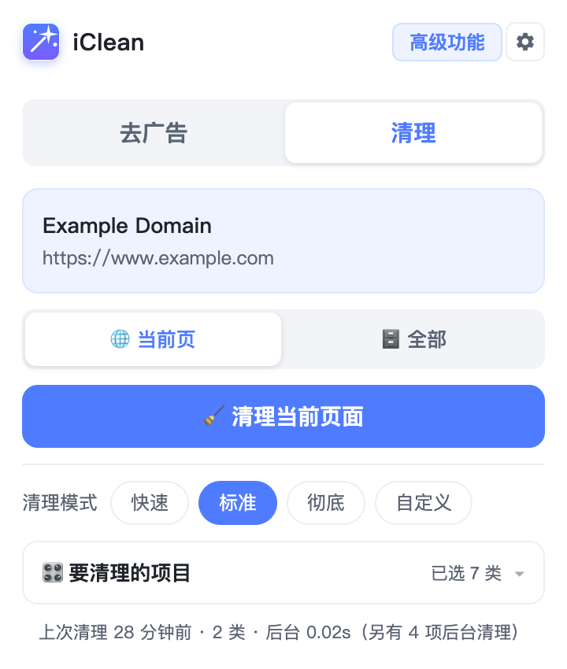
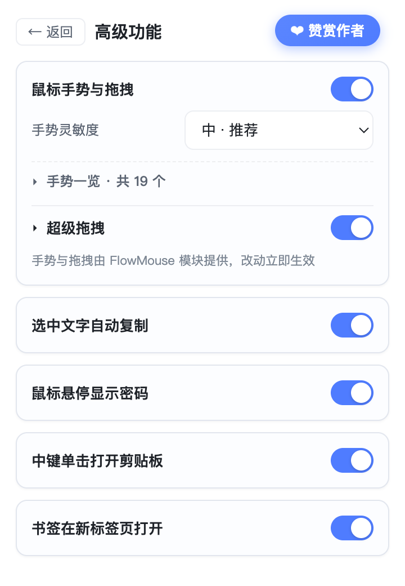

# iClean

> 一键清理浏览器数据，顺手多一点效率。

Chrome 扩展（Manifest V3）· 离线运行 · 不上传任何数据 · 无账号



---

## 功能

### 清理浏览数据

- **清理当前站点** —— 只清当前标签页所属站点的 Cookie / 缓存 / Storage / IndexedDB 等，不影响其它网站
- **一键清理全部** —— 清理所有站点的数据，支持时间范围（全部 / 1 小时 / 24 小时 / 7 天 / 30 天）
- **二次确认** —— 全局清理需再点一次确认，防误触
- **自动刷新** —— 全局清理完成后自动刷新所有网页，立即生效
- **后台分批** —— 慢项（缓存 / Cache Storage / Service Worker / 历史等）转后台执行，界面不卡
- **清理模式** —— 快速 / 标准 / 彻底三档预设，也可逐项勾选，选择会被记住
- **白名单** —— 保护常用站点，清理当前页时自动跳过

### 效率增强

| 功能 | 说明 |
| --- | --- |
| **鼠标手势** | 按住右键划动执行后退、前进、滚动、切换标签等 |
| **超级拖拽** | 拖动文字搜索、拖动链接新标签打开、拖动图片打开图片 |
| **书签新标签打开** | 点击书签在新标签打开，当前页面保持不动，**不改写书签地址** |
| **选中文字自动复制** | 选中文字即自动复制，无需按 Ctrl+C；输入框内不触发 |
| **鼠标悬停显示密码** | 鼠标移到密码框上明文显示，移开自动恢复 |

---

## 安装

### 方式一：Chrome 应用商店

> 商店链接待补充

### 方式二：开发者模式加载

1. 下载本仓库（或 Releases 中的 zip）并解压
2. 打开 Chrome，访问 `chrome://extensions`
3. 右上角开启 **开发者模式**
4. 点击 **加载已解压的扩展程序**，选择解压出的文件夹
5. 工具栏出现 iClean 图标，点击即可使用

> 如需清理本地 `file://` 页面，请在扩展详情页开启「允许访问文件网址」。

---

## 使用

点击工具栏图标打开面板，顶部两个标签切换清理范围：

- **当前页** —— 显示当前站点，点击「清理当前页面」即可
- **全部** —— 选择时间范围后点「清理全部数据」（需二次确认）

面板底部的折叠框里有两个标签：

- **清理项目** —— 勾选要清理的数据类型
- **白名单** —— 每行一个域名，清理当前页时跳过

右上角 **高级功能** 进入设置页，可开关手势、超级拖拽、自动复制、显示密码、书签新标签等功能。

---

## 项目结构

```
chrome-cleaner/
├── manifest.json              扩展清单（MV3）
├── build.sh                   打包脚本（terser 压缩自研代码）
├── cancel.html                书签模块的本地 204 端点页面
├── rules.json                 DNR 重定向规则
├── js/
│   ├── content.js             手势与拖拽主体
│   ├── gesture-*.js           手势识别与轨迹绘制
│   ├── background.js          手势动作执行器
│   ├── auto-copy.js           选中文字自动复制
│   ├── show-password.js       鼠标悬停显示密码
│   └── bookmark-worker/       书签新标签打开（6 个模块）
├── src/
│   ├── popup/                 弹窗界面
│   ├── options/               独立设置页
│   ├── background/            Service Worker（清理指令调度）
│   └── shared/                数据类型表 / 配置存储 / 清理核心
├── icons/                     图标
├── _locales/                  多语言
└── docs/                      介绍页与截图
```

---

## 技术说明

### 清理

`chrome.browsingData` 的 `origins` 过滤只对 Cookie / Storage / 缓存生效，历史、下载、表单数据、密码只能全局清理。清理任务在 Service Worker 中执行，避免弹窗关闭中断。

清理分两批：**快批**（Cookie / localStorage / IndexedDB）完成即反馈，**慢批**（缓存 / Cache Storage / Service Worker 等）转后台串行执行，弹窗轮询进度显示「后台清理中…」。

### 书签新标签打开

书签 URL 会被加上 `newtab@` 标记，`declarativeNetRequest` 把带标记的请求重定向到扩展内的 `cancel.html`，由 Service Worker 的 `fetch` 拦截直接返回 **204 No Content** —— 浏览器收到 204 不会离开当前文档，因此**当前页完全不动，且全程零网络请求**。

---

## 第三方组件与许可

本项目包含以下开源组件，**其许可证要求同样适用于本项目**：

| 组件 | 用途 | 许可证 |
| --- | --- | --- |
| FlowMouse 系鼠标手势实现 | 手势与超级拖拽 | **GPL v3** |
| [Open Bookmarks in New Tab](https://github.com/sssstf0rest/Open-Bookmarks-in-New-Tab) | 书签在新标签打开 | MIT |

> 因包含 GPL v3 组件，本项目整体以 **GNU GPL v3** 发布。详见 [`THIRD_PARTY_LICENSES.md`](THIRD_PARTY_LICENSES.md) 与 [`LICENSE`](LICENSE)。

---

## 打包

```bash
bash build.sh
```

脚本会复制源码到临时目录、用 terser 压缩自研 JS（保留版权注释）、输出 `iclean-v{版本}.zip`。**第三方模块不压缩**，保持源码可读以符合其许可证要求。源码目录不会被改动。

---

## 赞赏

如果这个工具帮到了你，欢迎扫码请作者喝杯咖啡。


---

## License

[GNU General Public License v3.0](LICENSE)
