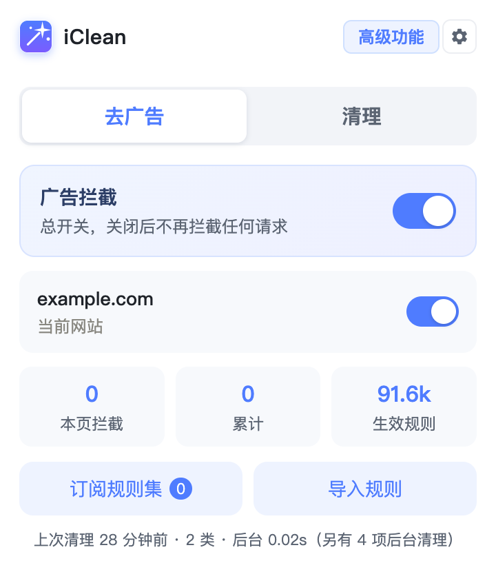

# iClean

> 净化广告、清理垃圾数据，还有鼠标手势。

Chrome 扩展（Manifest V3）· 离线运行 · 不上传任何数据 · 无账号



---

## 功能

### 净化广告

**内置 AdGuard Base + 中文规则集，装完即拦，不用先订阅**；也可以自己粘贴规则或订阅任意规则集
（参考 AdGuard MV3 的能力拆分）：

| 能力 | 说明 |
| --- | --- |
| **内置规则集** | 随扩展预装 AdGuard Base（网络 7.9 万 + 隐藏 1.4 万条）与 AdGuard 中文（网络 1.3 万 + 隐藏 1 千条），**不占订阅额度**，装完就能拦 |
| **订阅规则集** | 粘贴规则集网址（EasyList 等），扩展下载并解析；可单独开关、单独更新、一键全部更新 |
| **网络拦截** | 内置 / 订阅 / 手动粘贴的 Adblock 网络规则，命中请求直接拦掉，不发出去 |
| **元素隐藏** | `##` 元素隐藏规则，把页面里的广告位 `display:none` 掉（含内置的通用规则） |
| **去跟踪参数** | `$removeparam` 规则，跳转时把网址里的 `utm_source`、`fbclid` 这类跟踪参数去掉 |
| **总开关** | 一键停用全部拦截（网络 + 隐藏同时停） |
| **本站开关** | 当前网站一键加白，加白后本站不拦也不隐藏 |
| **豁免白名单** | 在设置页集中管理已加白的站点 |
| **导入规则** | 弹窗和设置页都能粘贴规则；设置页可回填上次导入的原文 |

订阅的规则集**只在点「更新」时才联网**，平时不产生任何网络请求；规则集原文不会存进扩展，只存解析后的规则。

内置几个常用规则集入口，按用途分好类，点一下即可添加（也可以填任意自己的网址）：

**广告**

| 规则集 | 干什么 | 规模（实际收下） |
| --- | --- | --- |
| EasyList China | 国内站点的广告，最基础的一份 | 网络 1.2 万 · 隐藏 6 千 |
| EasyList | 国际主流广告（规则量很大，只收得下一部分） | 网络 2.9 万 · 隐藏 6 千 |

**拦截追踪**

| 规则集 | 干什么 | 规模（实际收下） |
| --- | --- | --- |
| EasyPrivacy | 拦追踪脚本、追踪像素、分析工具的请求 | 网络 2.9 万 · 隐藏 2 |
| AdGuard 去跟踪参数 | 去掉网址里的 `utm_source`、`fbclid` 等参数，需配合「从网址移除跟踪参数」开关 | 2683 条 → 合并后 932 |

> ⚠️ **不用再单独订 AdGuard 中文** —— 它已经作为内置规则集预装了（见下面「内置静态规则集」），
> 再订一份不会多生效。AdGuard 中文本身就内含 EasyList China，两份订其一即可。

订之前值得知道各列表的**实际收下量**（实测，受单条 29000 上限约束）：

| 列表 | 体积 | 解析 | 收下·拦截请求 | 收下·隐藏元素 | 存储 |
| --- | --- | --- | --- | --- | --- |
| EasyList China | 534 KB | 0.3s | 11846 | 6000 | 1.54 MB |
| AdGuard 去跟踪参数 | 179 KB | 0.05s | 2618 | 1 | 0.50 MB |
| EasyPrivacy | 1.4 MB | 0.6s | 29000（顶到上限） | 2 | 2.55 MB |
| EasyList | 2.5 MB | 1.2s | 29000（顶到上限） | 6000 | 3.4 MB |
| AdGuard Tracking Protection | **10.7 MB** | **5.9s** | 29000（顶到上限） | 285 | 2.56 MB |

- **`AdGuard Base` / `AdGuard 中文` 不用再订** —— 它们已经作为内置静态规则集预装了，不占订阅额度（见下面「内置静态规则集」）。
- **`AdGuard Tracking Protection` 不建议订阅**：要下 10.7 MB、解析 5.9 秒，30 多万条里只有 29000 条能收下。
- 多个列表一起订时合并后很快就顶到浏览器的 30000 条硬上限——**再订也不会多生效**，后面的列表会被前面的挤掉（先订的先占）。一个广告列表 + 一个追踪列表就够了。

### 去跟踪参数

打开设置页的「从网址移除跟踪参数」后，跳转时会把网址里的 `utm_source`、`fbclid`、`gclid` 这类参数去掉，用的是 DNR 的 `redirect` + `queryTransform.removeParams`——**请求发出前就改掉**，不是页面加载完再改地址栏。

配合 **AdGuard URL Tracking filter**（`https://filters.adtidy.org/extension/ublock/filters/17.txt`）使用，推荐入口里有一键添加。规则里的 `$removeparam=x` 例外（如 `@@/authentication/login?$removeparam=analytics_trace_id`）也会生效，登录流程不会被破坏。

实测（Chrome 153）：
- 只作用于**主框架导航**，不会去动网站自己发的子资源请求
- 网址里没有该参数时**不会白白重定向**
- `domain=` 映射到 DNR 的 `requestDomains`（主框架导航没有 initiator，用 `initiatorDomains` 匹配不上）
- **DNR 一次请求只会应用一条 redirect 规则**，所以条件相同的 `$removeparam` 规则会被合并成一条：AdGuard 那份列表 2607 条 removeparam 规则合并后是 932 条，同时删 `utm_source` 和 `utm_medium` 都能生效
- 广告拦截总开关关闭时本项也不生效

支持的 Adblock 写法：

```
ads.example.com                      纯域名 → 自动当成 ||ads.example.com^
||tracker.example.net^               标准网络规则
*ads*                                通配符
/static/ad/banner.gif                路径匹配（以 / 开头但不是正则）
@@||good.example.com^                例外规则（放行）
||ads.example.com^$third-party       只拦第三方请求
||img.example.org^$script,image      限定资源类型
||ads.example.com^$domain=a.com|~b.com   限定发起方域名（~ 为排除）
/ads\d+\.js/                         正则规则
/ads\d+/$script,domain=a.com         正则 + 选项
##.ad-banner                         通用元素隐藏
example.com##div[id^="ads"]          只在该域名（含子域）隐藏
example.com#@#.ad                    隐藏例外：在该站取消隐藏 .ad
#@#.ad                               隐藏例外：全局取消隐藏
example.com#?#div:has(ul > li)       扩展选择器（选择器是纯 CSS 时按隐藏处理）
$removeparam=utm_source               去掉网址里的这个参数
||example.com^$removeparam=fbclid     只在匹配到该模式时去掉
$removeparam                          去掉网址里的全部参数
@@||shopify.com/authentication/$removeparam=analytics_trace_id   例外：该路径不删
! 这是注释                            注释行会被忽略
```

支持的资源类型（含各种别名写法）：`script` `image`/`imageset` `stylesheet`/`css`
`xmlhttprequest`/`xhr` `subdocument`/`sub_frame` `document`/`doc` `object`/`object-subrequest`
`media` `font` `ping`/`beacon` `websocket` `other`，都可用 `~` 取反。

**不支持**的写法（这类规则会被**整条跳过**，而不是忽略选项后照拦——那样会拦得比原列表更多、误伤网站）：
`$generichide` / `$genericblock` / `$elemhide`、`$popup`、`$csp`、`$redirect`、
`$rewrite`、`$badfilter`、`$removeparam=/正则/`；`#?#` 里带 `:has-text()` 这类程序化伪类的规则
（浏览器原生 CSS 表达不了，实测 EasyList 的 `#?#` 里 99% 都是这种）。

规则分两类，**上限是分开算的**：

- **拦截请求**（网络规则）—— 请求还没发出去就被拦掉，写法是域名 / 通配符 / 正则
- **隐藏元素**（元素隐藏规则）—— 广告请求被拦掉后留下的空白框，用 CSS `display:none` 藏起来，写法是 `##` 开头

| 范围 | 拦截请求 | 隐藏元素 | 正则规则 |
| --- | --- | --- | --- |
| 单条订阅 | 29000 | 6000 | 900 |
| 全部合并后 | 29500 | 8000 | 900 |
| 所有订阅合计（存储预算，**不是生效上限**） | 60000 | — | — |

> **两个数字说的是两件事，别混**：
> - **真正生效的拦截请求规则是 29500 条** —— 浏览器对动态规则有 30000 条硬顶，这里留 500 余量。这是实际在拦广告的条数，谁都突破不了。
> - **60000 条是「能存多少」** —— 多存是为了切换订阅时不用重新下载（下一份 10 MB 的列表要 2 秒、解析 6 秒），但同一时刻真正生效的仍然只有 29500 条。订了多个大列表时按**订阅顺序先到先得**，后面的基本挤不进去。

超出的规则会被截断，订阅列表里会标出「截断 N 条」。分开限是因为代价不同：拦截请求要写进浏览器的规则表，有 30000 条硬上限；隐藏元素会拼成一段 CSS 注入到**每个页面**，太多会拖慢网页。正则单独压到 900，是因为浏览器对 `regexFilter` 有 1000 条独立硬上限（实测 1100 条时报 `Dynamic rule count for regex rules exceeded.`），另外**单条正则编译后还有 2KB 内存上限**（超了那条会被跳过）。

「所有订阅合计」是存储预算，不是生效上限：`storage.local` 默认配额 10 MB，实测 15000 条约 1.36 MB、29000 条约 2.55 MB，所以取 60000 条（约 5.6 MB）。订第二个大列表时，单条上限会自动被压到「60000 − 其它订阅已占条数」。

截断隐藏元素规则时 **`#@#` 例外优先保留**——丢一条例外会让本不该隐藏的继续被隐藏，比少隐藏一条更糟。

### 内置静态规则集

扩展里预装了两份 AdGuard 规则集，**装完就能拦，不用先订阅**：

| 规则集 | 网络规则 | 元素隐藏 | 体积 |
| --- | --- | --- | --- |
| AdGuard Base | 78718 | 通用 13376 + 按域名 31983 条 / 20646 个域名 | 8.5 MB |
| AdGuard 中文 | 12701 | 通用 914 + 按域名 6901 条 / 2946 个域名 | 1.3 MB |

> 用的是 AdGuard 官方的 **chromium-mv3 预编译版**（源文件带 `!#if` 平台条件块，
> 直接拿原版会把 iOS / 安卓 / 火狐专用的规则一起吞进来）。

**为什么要有它**：Chrome 对「动态规则」有 **30000 条硬上限**（实测 30001 条直接报 `Dynamic rule count exceeded.`），
而「静态规则」的可用额度是 **33 万条级别**（实测 `getAvailableStaticRuleCount()` = 329999，11 倍）。
静态规则 **不占动态额度**，所以内置的这部分等于白赚 —— 订阅走的动态那 3 万条可以完整留给用户自己订的列表。

代价有两条，都在设置页写明了：

1. **规则随扩展版本更新**，点「更新」拉不到最新的（静态规则只能随扩展安装/升级变更）
2. **静态规则配额是全局共享的**：330000 是所有扩展共用的，保底只有 30000 条。
   如果你还装了 AdGuard / uBlock，两边会互相挤

设置页「广告设置 → 内置静态规则集」可以逐个关掉。

**元素隐藏规则为什么单独出文件**：网络规则拦不住**内联在 HTML 里**的广告（`` 这种，
图片来自站点自家的兄弟域名，任何通用列表都不会拦它）。AdGuard Base 里有上万条 `##` 隐藏规则，
但 DNR 的静态规则集装不下它们，所以拆成三份：

- **通用隐藏 CSS**（`*.cos-gen.css`）：对所有站点生效，内容脚本直接 fetch 后整段注入 `<style>`
- **按域名的规则**（`*.cos-bNN.json`）：按域名哈希分 **64 个桶**，只取本站命中的 1~4 个桶
- **有 `#@#` 例外的通用规则**（`*.cos-ct.json`）：CSS 没法把已经 `!important` 隐藏的元素恢复成本来的
  `display`（`revert` 会连页面自己的样式一起抹掉），所以这些在构建时就排除出通用 CSS，改按站点下发

> ⚠️ 为什么不合成一个文件让后台算好再发下来：按域名的规则合起来有 2.5 MB，后台读一次实测
> `fetch().text()` 稳定 197ms + `JSON.parse` 100ms，而 **MV3 的 Service Worker 空闲会被回收** ——
> 这个代价每次导航都可能重来，广告会闪半秒。分桶 + 内容脚本直取，代价降到毫秒级。

**正则规则也不进静态规则集**：DNR 的 `regexFilter` 有个「编译后 2KB 内存」上限，**只有浏览器自己知道**
某条超没超（`isRegexSupported()` 才答得准），构建期无法判定；而静态规则集里**只要有一条不合法，
整个扩展就加载失败**（实测 AdGuard Base 的 223 条正则里有 42 条超限）。所以正则单独出
`*.regex.json`，运行时逐条体检后当动态规则写 —— 坏一条只丢一条。

**生成方式**：静态规则集由 `tools/build-ruleset.js` 在打包时预编译，运行时不能下载。

```bash
node tools/build-ruleset.js --list                        # 看有哪些预设
node tools/build-ruleset.js adguard-base                  # 下载最新版并生成
node tools/build-ruleset.js adguard-base --from f.txt     # 用本地文件（离线/可复现）
```

它复用运行时同一套解析器（`src/background/ad-parse.js`，纯函数、无 chrome 依赖，
浏览器里被 `importScripts` 加载、node 里直接 `require`），所以**编译产物和运行时行为完全一致**。
生成后会自动更新 `src/background/builtin-rulesets.js` 里的条数元数据 —— 静态规则 `getDynamicRules()` 数不到，
条数固化下来才能让界面上的「生效规则」如实显示。

构建脚本自带 9 项自检（id 连续 / urlFilter 纯 ASCII / **静态集零正则** / 通用 CSS 无例外泄漏 等），
任何一条不过就拒绝出产物 —— 因为这些问题会让**整个扩展加载失败**，不是只坏一条规则。

### 禁用网页 WebRTC

打开设置页「广告设置」里的「禁用网页 WebRTC」后，浏览器不再向网页提供任何「可被连接的地址」（ICE 候选）。
（开关默认关闭。设置页现在默认进「广告设置」，要进「高级功能」点侧边栏第二项，或带 `#general` 深链。）

WebRTC 建立 P2P 连接前，浏览器要先交出一份「我能在哪些地址上被连到」的清单，也就是 ICE 候选。候选分三类：

| 类型 | 来源 | 泄露程度 |
| --- | --- | --- |
| `host` | 本机网卡地址 | 低 —— 真实内网 IP 已被 Chrome 换成随机 mDNS 名字，且实测**每次页面加载都换新的** |
| **`srflx`** | 问 STUN 服务器拿到的公网地址 | **高** —— 用代理时可能暴露真实公网 IP |
| `relay` | TURN 中转服务器 | 不暴露本机 |

打开开关后策略设为 `disable_non_proxied_udp`，实测**网页拿到的候选从 1 个变成 0 个**。

> ⚠️ **别把它当「防 IP 泄露」用。** 它拦的是「网页拿不到你的本机地址」，**不是**「隐藏你的真实 IP」。
> 用 Loon / Shadowrocket / Clash TUN 这类**系统级代理**时，Chrome 看不到「配了代理」
> （VPN 是系统层的，对 Chrome 不可见），会把所有 UDP 都算作「未经代理」一并禁掉——
> 效果等价于**把 WebRTC 整个关掉**，而你的真实 IP 本来就在隧道里、并没有漏。
> 只有当「WebRTC 泄露检测站点报出来的是真实 IP」时，打开它才有意义。

代价：网页里的实时音视频、P2P 传文件、联机游戏会连不上。
关掉开关时会把**你原来的策略还回去**（记下了开之前的值，不是无脑设成默认）。

### 清理垃圾数据

- **清理当前站点** —— 只清当前标签页所属站点的 Cookie / 缓存 / Storage / IndexedDB 等，不影响其它网站
- **一键清理全部** —— 清理所有站点的数据，支持时间范围（全部 / 1 小时 / 24 小时 / 7 天 / 30 天）
- **二次确认** —— 全局清理需再点一次确认，防误触
- **自动刷新** —— 全局清理完成后自动刷新所有网页，立即生效
- **后台分批** —— 慢项（缓存 / Cache Storage / Service Worker / 历史等）转后台执行，界面不卡
- **清理模式** —— 快速 / 标准 / 彻底三档预设，也可逐项勾选，选择会被记住
- **白名单** —— 保护常用站点，清理当前页时自动跳过

---

### 鼠标手势与效率增强

| 功能 | 说明 |
| --- | --- |
| **鼠标手势** | 按住右键划动执行后退、前进、滚动、切换标签等 |
| **超级拖拽** | 拖动文字搜索、拖动链接新标签打开、拖动图片打开图片 |
| **书签新标签打开** | 点击书签在新标签打开，当前页面保持不动，**不改写书签地址** |
| **选中文字自动复制** | 选中文字即自动复制，无需按 Ctrl+C；输入框内不触发 |
| **鼠标悬停显示密码** | 鼠标移到密码框上明文显示，移开自动恢复 |

---

## 安装

### 方式一：Chrome 应用商店

> 商店链接待补充

### 方式二：开发者模式加载

1. 下载本仓库（或 Releases 中的 zip）并解压
2. 打开 Chrome，访问 `chrome://extensions`
3. 右上角开启 **开发者模式**
4. 点击 **加载已解压的扩展程序**，选择解压出的文件夹
5. 工具栏出现 iClean 图标，点击即可使用

> 如需清理本地 `file://` 页面，请在扩展详情页开启「允许访问文件网址」。

---

## 使用

点击工具栏图标打开面板，顶部两个一级标签：

- **去广告** —— 总开关、本站开关、拦截统计，以及「订阅规则集」「导入规则」两个按钮
- **清理** —— 当前页 / 全部两个二级标签

**去广告**面板里，弹窗只放常用开关；规则集管理在独立设置页：

- **订阅规则集** —— 粘贴规则集网址（或用内置的推荐入口），点「添加」即下载解析
- **导入规则** —— 手动粘贴少量规则，支持网络规则与元素隐藏

弹窗右上角「设置」进入独立设置页，左侧栏切到「广告设置」，可管理内置静态规则集（逐个开关）、订阅列表（单独开关 / 更新 / 删除 / 全部更新）、自定义规则与豁免白名单。

**清理**面板里：

- **当前页** —— 显示当前站点，点击「清理当前页面」即可
- **全部** —— 选择时间范围后点「清理全部数据」（需二次确认）

面板底部的折叠框里有两个标签：

- **清理项目** —— 勾选要清理的数据类型
- **白名单** —— 每行一个域名，清理当前页时跳过

右上角有两个按钮：

- **高级功能** —— 手势、超级拖拽、自动复制、显示密码、书签新标签等开关
- **设置** —— 独立设置页，左侧栏切换「高级功能 / 广告设置」，广告设置里可集中管理自定义规则与豁免白名单

---

## 项目结构

```
chrome-cleaner/
├── manifest.json              扩展清单（MV3）
├── build.sh                   打包脚本（terser 压缩自研代码）
├── cancel.html                书签模块的本地 204 端点页面
├── rules.json                 书签模块的 DNR 重定向规则（静态规则集）
├── js/
│   ├── content.js             手势与拖拽主体
│   ├── gesture-*.js           手势识别与轨迹绘制
│   ├── background.js          手势动作执行器
│   ├── auto-copy.js           选中文字自动复制
│   ├── show-password.js       鼠标悬停显示密码
│   ├── middle-click.js        中键单击打开剪贴板内容
│   ├── cosmetic.js            元素隐藏（注入 CSS）
│   └── bookmark-worker/       书签新标签打开（6 个模块）
├── src/
│   ├── popup/                 弹窗界面
│   ├── options/               独立设置页
│   ├── background/            Service Worker（清理调度 + 广告规则引擎 + 规则解析器）
│   └── shared/                数据类型表 / 配置存储 / 清理核心 / 预览 mock
├── rulesets/                  内置静态规则集（构建产物，136 个文件约 13 MB）
│   ├── adguard-*.json         网络规则（静态规则集，manifest 里声明）
│   ├── adguard-*.regex.json   正则规则（运行时体检后当动态规则写）
│   ├── adguard-*.cos-gen.css  通用元素隐藏 CSS（内容脚本直接 fetch）
│   ├── adguard-*.cos-ct.json  有 #@# 例外的通用隐藏规则
│   └── adguard-*.cos-bNN.json 按域名的隐藏规则（64 桶）
├── tools/build-ruleset.js     内置规则集的构建脚本
├── icons/                     图标
├── _locales/                  多语言
└── docs/                      介绍页与截图
```

---

## 技术说明

### 清理

`chrome.browsingData` 的 `origins` 过滤只对 Cookie / Storage / 缓存生效，历史、下载、表单数据、密码只能全局清理。清理任务在 Service Worker 中执行，避免弹窗关闭中断。

清理分两批：**快批**（Cookie / localStorage / IndexedDB）完成即反馈，**慢批**（缓存 / Cache Storage / Service Worker 等）转后台串行执行，弹窗轮询进度显示「后台清理中…」。

### 书签新标签打开

书签 URL 会被加上 `newtab@` 标记，`declarativeNetRequest` 把带标记的请求重定向到扩展内的 `cancel.html`，由 Service Worker 的 `fetch` 拦截直接返回 **204 No Content** —— 浏览器收到 204 不会离开当前文档，因此**当前页完全不动，且全程零网络请求**。

### 净化广告

两块能力、一套开关：

- **规则来源** —— 内置静态规则集 + 手动粘贴 + 订阅规则集，合并去重后使用。订阅只存解析后的结构化规则（原始文本不保存，有网址就能重新拉），所以几个大规则集也占不了多少空间。
- **网络拦截** —— 内置的走 DNR **静态规则集**（不占动态额度），订阅和手动的由 Service Worker 翻译成 **动态规则**。优先级分四层（数字越大越优先）：删参数 `1` / 拦截 `2` / 网络例外 `@@` `3` / 站点白名单 `4`。例外放在第 `3` 层是有意的：同优先级下 `allow` 压过 `redirect`，这样例外只压掉重定向、压不掉拦截。正则规则走 `regexFilter`（另有 1000 条独立上限）。
- **元素隐藏** —— `js/cosmetic.js` 作为独立 content script（`document_start`、`all_frames`）注入。规则来自三处：手动粘贴、已启用订阅、**内置规则集**（通用 CSS 直接 fetch 整段注入；按域名的按域名哈希分 64 桶只取本站命中的那几个）。按当前主机名筛选后拼成一段 CSS 塞进一个 `<style>`。因为是纯 CSS，动态插入的元素也会自动被隐藏，不需要 MutationObserver 轮询。`#@#` 例外的做法是：先收集「隐藏」和「例外」两组选择器，再从隐藏列表里剔除被例外命中的。
- **去跟踪参数** —— `$removeparam` 规则翻译成 DNR 的 `redirect` + `transform.queryTransform.removeParams`。删参数的例外也放在第 `1` 层，理由同上。

实测踩到的坑，代码里都做了处理：

- Chrome 的 `urlFilter` **不接受 `||` 后面紧跟 `*`**（如 `||*.example^`），实测 EasyList China 12186 条里正好 4 条踩这个坑，且这是唯一一类不合法写法；解析时直接丢弃。万一还有别的写法被浏览器整批拒收，会降级成分块探测，把不合法的规则挑出去、保住其余规则，而不是整批失败。
- **`urlFilter` 不能含非 ASCII**，否则**整个静态规则集加载失败**（连带整个扩展起不来）。解析阶段就丢掉。
- **`/static/tb/x.gif` 这类「只是路径里带斜杠」的规则不是正则**（EasyList China 有 700+ 条）。只有「以 `/` 开头、且**第一个未被转义的** `/` 之后是空或 `$选项`」才算正则，否则必须继续按 `urlFilter` 处理——一开始按「以 `/` 开头」判断，把这 700 多条全丢了。
- **拆 `$选项` 要用「第一个未被转义的 `$`」**，不能用 `lastIndexOf('$')`：选项值里可能再出现 `$`（如 `domain=/^x\.info$/`），切错会把选项吞进模式里，轻则失效、重则把整站封了。
- **`regexFilter` 不能和 `urlFilter` 同时出现在一条规则里**，且 RE2 不支持前瞻/后顾/反向引用（会在解析时就挡掉）。
- **`$removeparam=x` 这种「选项在最前面、没有模式」的规则**，第一个 `$` 正好在位置 `0`，用 `> 0` 判断会把整串当成网址模式，解析出一堆垃圾规则。
- **DNR 一次请求只应用一条 `redirect` 规则**（实测两条各删一个参数时只有一个生效），所以条件相同的 `$removeparam` 规则必须合并成一条；合并键还要**忽略 `excludedRequestDomains`** 并把排除域名取并集，否则带 `$denyallow` 的规则会输给通用规则、一个参数都删不掉。
- **`regexFilter` 编译后还有 2KB 内存上限**：超了浏览器会**让整个 `updateDynamicRules` 调用失败**（报错信息里带着违规规则的 id），不是静默跳过那一条。所以写入失败时要**从报错里抠出 id、剔掉那一条再重试整批**——比逐块二分快几个数量级。
- **写完必须回读校验**：`updateDynamicRules` 成功不代表条数对。曾经出现过「上报 12760 条、DNR 里其实只有 914 条」——兜底逻辑最后那次补写失败却照样报成功，界面上的数字全是假的。现在以 `getDynamicRules().length` 为准。
- **两个 `updateDynamicRules` 并发会互相踩**（条数变成随机数，实测同一段操作出现过 169/176/180 三种结果），所以重建走一条串行队列。
- 长连接的 `msg.id` 被前端用作请求序号，订阅 id 必须走 `subId`，否则会被覆写掉。

总开关关闭时不仅清空动态规则，还会**同时停用内置静态规则集**（`updateEnabledRulesets`）——它们在 manifest 里声明为启用，不受动态规则增删影响，只管动态规则的话关掉开关也还在拦。元素隐藏则通过 `chrome.storage.onChanged` 立刻撤掉。**全程零外部依赖、不上传任何数据，规则集只在点「更新」时才联网。**

---

## 第三方组件与许可

本项目包含以下开源组件，**其许可证要求同样适用于本项目**：

| 组件 | 用途 | 许可证 |
| --- | --- | --- |
| FlowMouse 系鼠标手势实现 | 手势与超级拖拽 | **GPL v3** |
| [Open Bookmarks in New Tab](https://github.com/sssstf0rest/Open-Bookmarks-in-New-Tab) | 书签在新标签打开 | MIT |

> 因包含 GPL v3 组件，本项目整体以 **GNU GPL v3** 发布。详见 [`THIRD_PARTY_LICENSES.md`](THIRD_PARTY_LICENSES.md) 与 [`LICENSE`](LICENSE)。

---

## 打包

```bash
bash build.sh
```

脚本会复制源码到临时目录、用 terser 压缩自研 JS（保留版权注释）、输出 `iclean-v{版本}.zip`。**第三方模块不压缩**，保持源码可读以符合其许可证要求。源码目录不会被改动。

---

## 赞赏

如果这个工具帮到了你，欢迎扫码请作者喝杯咖啡。


---

## License

[GNU General Public License v3.0](LICENSE)
